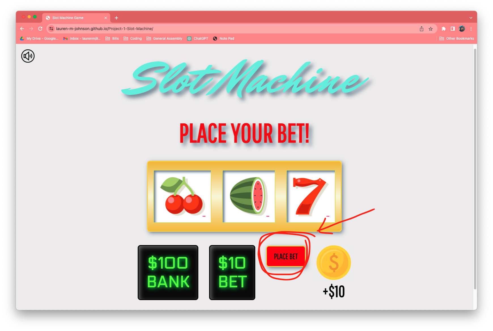

# 🎰 Project 1: Slot Machine 🎰

## 📖 Table of Contents
- [Game Description](#🧩-game-description)
- [Technologies Used](#👩🏽‍💻-technologies-used)
- [Code Preview](#🔍-code-preview)
- [Links](#🔗-links)
- [Getting Started](#🕹️-getting-started)
- [Ice Box Features](#🧊-next-steps-and-icebox-items)

## 🧩 Game Description: 

This browser slot machine game transports you to a world of excitement and the chance to "WIN BIG". With captivating graphics and seamless gameplay, place your bet to align symbols and trigger wins or lose it all. Are you ready to chase your fortune? Play now and spin your way to unimaginable wealth, figuratively of course!

### Preview:


## 👩🏽‍💻 Technologies Used:

 

 
 
 

## 🔍 Code Preview

```js
function renderBank() {
    if (win === true) {
        bet *= 2;
        bank += bet;
        coinButton.disabled = false;
    } else if (win === false) {
        bank -= bet;
    } else {
        return bank;
    }
    bankAmount.innerText = '$' + bank;
    bet = 10;
    betAmount.innerText = '$' + bet;
}
```
## 🔗 Links

- [Link to Slot Wire Frame](https://whimsical.com/slot-machine-3ni8sd4MxryPkw3zKyCD4N)
- [Link to Pseudocode](https://docs.google.com/document/d/1jk0KVBJTgBcEUXJVMCcF9Qd3EeM1F0o22SO2VOLtuo8/edit)

## 🕹️ Getting Started:

[Click to Play!](https://lauren-m-johnson.github.io/Project-1-Slot-Machine/)

### ⌨️ Instructions:

1. Increase your bet by $10 at a time by clicking the coin on the bottom right.


2. To place your bet and start your gameplay, click the "PLACE BET" button.



3. Immeditely see if you've won or lost. If you win, you will win DOUBLE your bet and it will be added to the bank. If you lose, your bet will be subtracted from your bank.

Loss Example:


Win Example:


4. Keep playing until your bank is empty and start again!


## 🧊 Next Steps and Icebox Items:

1. Slow down the randomization of images so that the user can see them generate.
2. Have slot1 generate before slot2 and slot2 generate before slot3 to make it appear more like a real slot machine.


